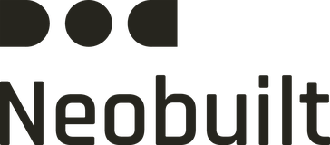

<a href="https://www.neo-built.com/">
  <picture>
    <source media="(prefers-color-scheme: dark)" srcset="assets/neobuilt-logo-light.png">
    
  </picture>
</a>

 
 

**Daniel Ol.** · BIM Developer at [Neobuilt](https://www.neo-built.com/) · BIM Specialist at Stegra · Gothenburg, Sweden

I build software for architecture, engineering and construction, with a focus on BIM automation, model data exchange and real-time 3D. My background is in architectural engineering and BIM coordination on large industrial and healthcare projects.

<samp>
  <a href="https://www.neo-built.com/">neo-built.com</a> ·
  <a href="https://www.neo-built.com/prism">Paramora Prism</a> ·
  <a href="https://github.com/danioliaei/Mohsen-oliaei-portfolio">Portfolio</a> ·
  <a href="https://www.linkedin.com/in/daniol/">LinkedIn</a>
</samp>

### Currently

Developing **[Paramora® Prism](https://www.neo-built.com/prism)**, a plugin for Autodesk Navisworks Manage that exports coordinated models to IFC, glTF, OpenUSD, 3D Tiles and other industry formats. Models are processed locally and never leave the workstation.

### Focus

- **BIM automation.** Revit and Navisworks add-ins in C# and .NET for coordination, model checking and delivery.
- **Model data exchange.** IFC and open-format pipelines that retain properties and classification.
- **Computational design.** Parametric workflows in Rhino and Grasshopper, and model reporting in Power BI.
- **Real-time 3D.** Browser-based visualization with TypeScript and WebGPU.

### Experience

- **Neobuilt**, BIM Developer, 2025 – present
- **Stegra**, BIM Specialist, 2025 – present
- **Northvolt**, BIM Coordinator, 2023 – 2024
- **Office for Collective Architecture**, BIM Modeler, 2023
- **White Arkitekter**, BIM Modeler, 2022

M.Sc. Architectural Engineering, Chalmers University of Technology.

### Stack

C# · .NET · Python · TypeScript · WGSL · Revit API · Navisworks API · IFC · Rhino · Grasshopper · Power BI · WebGPU
