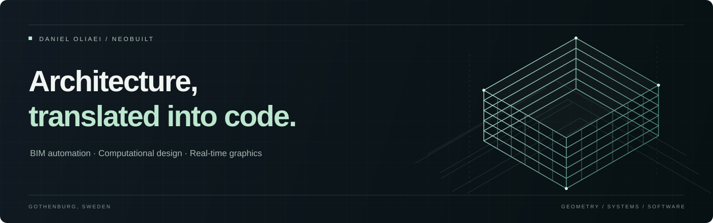

  

  <a href="https://www.neo-built.com/"><strong>Neobuilt ↗</strong></a>
  &nbsp;&nbsp; / &nbsp;&nbsp;
  <a href="https://github.com/danioliaei/Mohsen-oliaei-portfolio"><strong>Explore my portfolio ↗</strong></a>
  &nbsp;&nbsp; / &nbsp;&nbsp;
  <a href="https://www.linkedin.com/in/daniol/"><strong>LinkedIn ↗</strong></a>

 

### Bridging the built environment and software.

I'm **Daniel Oliaei**, a BIM developer and founder of **Neobuilt AB**, based in Gothenburg, Sweden. I build tools that turn complex models and repetitive workflows into practical, usable software.

My work connects architectural engineering with **BIM automation**, **computational design**, and **interactive 3D experiences**—from Revit and Navisworks add-ins to graphics rendered directly in the browser.

 

<table>
  <tr>
    <td valign="top" width="33%">
      01 / AUTOMATION
      <h3>Better workflows.</h3>
      
Custom tooling for model coordination, quality checks, and the repetitive parts of BIM.

      
<code>C# / .NET</code> <code>Python</code> <code>Revit API</code> <code>Navisworks API</code>

    </td>
    <td valign="top" width="33%">
      02 / COMPUTATION
      <h3>Design through data.</h3>
      
Geometry, performance analysis, and clear information that supports design decisions.

      
<code>Rhino</code> <code>Grasshopper</code> <code>Power BI</code> <code>IFC</code>

    </td>
    <td valign="top" width="33%">
      03 / VISUALIZATION
      <h3>Ideas made tangible.</h3>
      
Interactive spatial interfaces and real-time graphics with attention to motion and detail.

      
<code>TypeScript</code> <code>React</code> <code>WebGPU</code> <code>WGSL</code>

    </td>
  </tr>
</table>

 

### Featured work

#### [Daniel Oliaei — Interactive portfolio ↗](https://github.com/danioliaei/Mohsen-oliaei-portfolio)

A spatial exploration of my work, built with **React, TypeScript, and a custom WebGPU renderer**. Interactive geometry, shader-driven lighting, and carefully considered motion bring architectural thinking into the browser.

`Custom rendering` &nbsp; `Interactive 3D` &nbsp; `Reduced-motion support`

 

### A foundation in architecture. A focus on building tools.

My background spans architectural modelling, BIM coordination, and computational design. At **Neobuilt**, I develop bespoke tools for modelling and coordination; my BIM strategy work brings together information standards, model data, and stakeholder training.

**M.Sc. Architectural Engineering · Chalmers University of Technology**

---

  <strong>Let's make complex work simpler.</strong> 
  BIM tooling · Design automation · Spatial experiences  
  <a href="https://www.neo-built.com/">Neobuilt</a> &nbsp; · &nbsp;
  <a href="https://www.linkedin.com/in/daniol/">Connect on LinkedIn</a>

